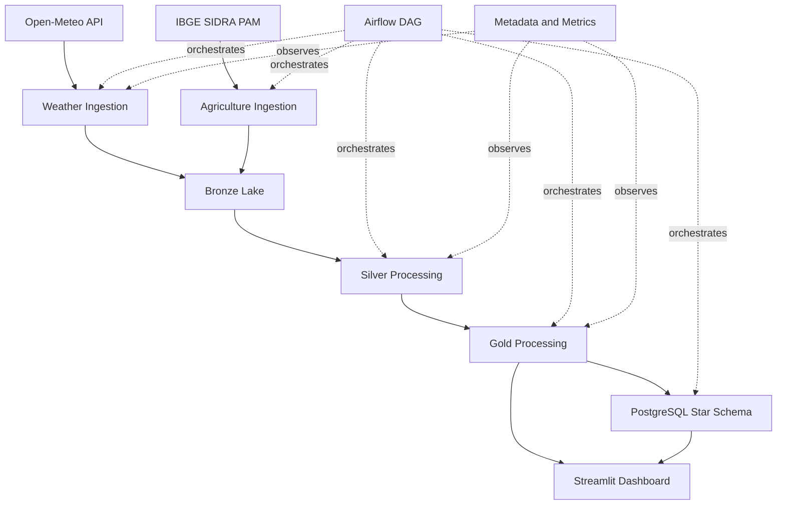

# AgroClimate Data Platform

Plataforma de Engenharia de Dados para monitoramento climatico aplicado ao agronegocio brasileiro. O projeto coleta dados meteorologicos da Open-Meteo, integra estatisticas agricolas do IBGE PAM, processa dados em camadas Bronze, Silver e Gold, aplica regras de qualidade, carrega um modelo dimensional em PostgreSQL e disponibiliza analises em um dashboard Streamlit.

O objetivo e demonstrar uma arquitetura de dados ponta a ponta, com foco em ingestao incremental, qualidade, transformacoes analiticas, observabilidade simples e uma experiencia local facil de executar.

## Destaques

- Ingestao de clima via API Open-Meteo com retries, timeout e metadata de execucao.
- Ingestao de producao agricola via IBGE SIDRA/PAM.
- Data lake local em Parquet com camadas Bronze, Silver e Gold.
- Processamento principal em PySpark e fallback local em Pandas para demos sem Java/Spark.
- Quarentena de registros climaticos invalidos.
- Thresholds de qualidade e risco centralizados em `src/config/risk_thresholds.yml`.
- Modelo dimensional em PostgreSQL com dimensoes, fatos climaticos e fatos agricolas.
- Loader PostgreSQL idempotente com staging temporario para carga meteorologica em lote.
- DAG Airflow para orquestracao.
- Dashboard Streamlit com panorama, riscos, balanco hidrico, agricultura e tabela analitica.
- Testes automatizados, lint, format check e GitHub Actions.

## Arquitetura



## Stack

- Python 3.10+
- httpx
- Pandas
- PyArrow / Parquet
- PySpark
- PostgreSQL
- Apache Airflow
- Streamlit
- Plotly
- Docker Compose
- pytest, ruff and black

## Estrutura

```text
src/
  config/        Configuracoes, localidades, produtos e thresholds
  ingestion/     Clientes e rotinas de extracao
  processing/    Transformacoes Bronze -> Silver -> Gold
  quality/       Regras e checks de qualidade
  storage/       Escrita no data lake local
  monitoring/    Metadata e metricas de execucao
  warehouse/     Carga do Gold para PostgreSQL
dags/            DAG Airflow
dashboard/       Aplicacao Streamlit
sql/             Schema, migracoes, indices e queries analiticas
tests/           Testes automatizados
docs/            Documentacao, screenshots e material de portfolio
scripts/         Validacao local, status e geracao de imagens
```

## Camadas De Dados

**Bronze**

Armazena dados proximos ao formato das fontes, enriquecidos com `ingestion_timestamp`, `source` e `pipeline_execution_id`. Registros climaticos invalidos sao enviados para `data/quarantine`.

**Silver**

Padroniza tipos, cria identificadores deterministicos, valida ranges, remove duplicidades e prepara os dados para consumo analitico.

**Gold**

Agrega dados meteorologicos diarios e cria indicadores como chuva acumulada, temperatura media movel, dias sem chuva e flags de risco. Tambem consolida resumos agricolas por ano, estado e cultura.

## Modelo Dimensional

O warehouse PostgreSQL usa um modelo estrela com:

- `dim_date`
- `dim_location`
- `dim_source`
- `dim_crop`
- `fact_weather_daily`
- `fact_agriculture_production`

A granularidade de `fact_weather_daily` e uma linha por data, localidade e fonte. A granularidade agricola e uma linha por ano, estado, cultura e fonte.

## Execucao Rapida Sem Docker

Use este caminho para validar o projeto e abrir o dashboard em uma maquina local sem depender de PostgreSQL, Airflow ou Spark.

```powershell
powershell -NoProfile -ExecutionPolicy Bypass -File .\scripts\validate_local.ps1 -SkipDocker
.\.venv\Scripts\python.exe -m streamlit run dashboard/app.py
```

O dashboard tenta ler primeiro do PostgreSQL. Se o warehouse nao estiver disponivel, ele usa automaticamente os arquivos Gold Parquet em `data/gold`.

## Execucao Completa Com Docker

```bash
cp .env.example .env
docker compose up -d
python -m src.pipeline
make load-warehouse
streamlit run dashboard/app.py
```

Servicos principais:

- Airflow: `http://localhost:8080`
- Streamlit: `http://localhost:8501`
- PostgreSQL: `localhost:5432`

## Comandos Uteis

```bash
make setup
make test
make lint
make format
make pipeline
make load-warehouse
make status
```

Validacao manual:

```bash
pytest
ruff check .
black --check src tests dags dashboard scripts
```

## Configuracao

As variaveis principais ficam em `.env.example`:

```env
POSTGRES_HOST=postgres
POSTGRES_PORT=5432
POSTGRES_DB=agroclimate
POSTGRES_USER=agroclimate
POSTGRES_PASSWORD=agroclimate

API_TIMEOUT=20
API_RETRIES=3
API_RETRY_BACKOFF_SECONDS=2
INITIAL_INGESTION_DATE=2026-08-01
DATA_DIR=data
LOG_LEVEL=INFO
STRICT_PIPELINE=false
```

Use `STRICT_PIPELINE=true` quando falhas em ingestao agricola ou processamento Spark devem interromper o pipeline local. O modo padrao favorece demos locais, usando fallback quando possivel.

## Qualidade De Dados

O projeto valida:

- campos obrigatorios;
- coordenadas geograficas;
- umidade relativa;
- precipitacao;
- velocidade do vento;
- temperatura;
- duplicidade de registros Silver;
- datasets vazios;
- colunas obrigatorias em Bronze, Silver e Gold;
- ranges de metricas climaticas e agricolas.

Os limites ficam centralizados em:

```text
src/config/risk_thresholds.yml
```

Isso evita divergencia entre Spark, fallback Pandas e checks de qualidade.

## Observabilidade

As execucoes gravam metadata local em `data/metadata`.

Arquivos principais:

- `weather_ingestion_open_meteo.json`: ultimo estado da ingestao climatica.
- `etl_pipeline_runs.jsonl`: historico de execucoes.
- `etl_dataset_metrics.jsonl`: metricas por dataset, camada e quantidade de registros.

Para consultar um resumo:

```bash
make status
```

## Dashboard

O dashboard Streamlit possui abas para:

- panorama climatico;
- riscos por cidade e estado;
- balanco hidrico;
- exposicao agricola;
- tabela filtravel para analise basica.

As screenshots do projeto ficam em:

```text
docs/screenshots/
```

Para regenerar as imagens de apresentacao:

```bash
python scripts/generate_linkedin_cards.py
```

## Airflow

A DAG principal e `agroclimate_pipeline`, definida em:

```text
dags/agroclimate_pipeline.py
```

Ela orquestra ingestao, validacoes, processamento Bronze/Silver/Gold e carga no PostgreSQL.

## CI

O GitHub Actions executa em pushes para `main` e pull requests:

- `ruff check .`
- `black --check src tests dags dashboard scripts`
- `pytest`

## Documentacao

- `docs/architecture.md`: visao de arquitetura.
- `docs/data_dictionary.md`: dicionario de dados.
- `docs/data_lineage.md`: linhagem.
- `docs/decisions.md`: decisoes tecnicas.
- `docs/portfolio.md`: resumo para demonstracao e entrevistas.

## Roadmap

- Adicionar MinIO como data lake S3-compativel opcional.
- Automatizar ingestao de dados CONAB.
- Evoluir o lake para formato transacional como Delta, Iceberg ou Hudi.
- Integrar Great Expectations ou Soda para checks declarativos.
- Adicionar alertas externos para falhas, freshness e queda de volume.
- Publicar o dashboard em ambiente cloud.
