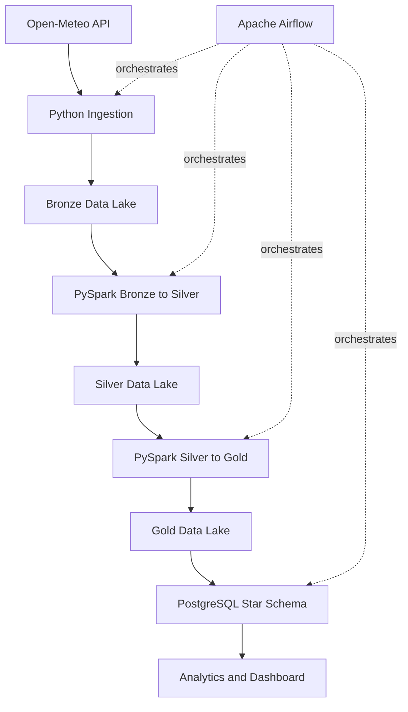

# AgroClimate Data Platform

Plataforma de Engenharia de Dados para coletar, processar, validar e disponibilizar dados meteorologicos aplicados ao agronegocio brasileiro.

## Architecture



## Stack

Python, httpx, PySpark, Parquet, PostgreSQL, Apache Airflow, Docker, pytest, ruff and GitHub Actions.

## Data Lake

The lake follows Bronze, Silver and Gold layers. Bronze stores API-shaped records with ingestion metadata. Silver standardizes types, validates ranges and removes duplicates. Gold aggregates daily weather metrics and IBGE PAM agricultural production summaries.

Processing is split by domain:

- Weather local fallback: `src/processing/local_fallback.py`
- Agriculture Bronze to Silver: `src/processing/agriculture_bronze_to_silver.py`
- Agriculture Silver to Gold: `src/processing/agriculture_silver_to_gold.py`
- Shared Parquet helpers: `src/processing/parquet_io.py`

## Dimensional Model

The warehouse uses `dim_date`, `dim_location`, `dim_source` and `fact_weather_daily`. The fact grain is one row per date, location and source.

## Quick Local Demo

Use this path to validate the project and open the dashboard without Docker. It is useful for portfolio reviews or workstations without Docker, Java or PostgreSQL available.

```powershell
powershell -NoProfile -ExecutionPolicy Bypass -File .\scripts\validate_local.ps1 -SkipDocker
streamlit run dashboard/app.py
```

Expected validation output:

- Python tests pass with `pytest`.
- Static checks pass with `ruff`.
- Formatting check passes with `black --check`.
- The pipeline writes Silver and Gold Parquet data under `data/silver` and `data/gold`.

The dashboard is available at `http://localhost:8501`. It first tries PostgreSQL and then falls back to Gold Parquet, so the local demo works even when the warehouse is not running.

## Full Local Stack

```bash
cp .env.example .env
docker compose up -d
python -m src.pipeline
make load-warehouse
streamlit run dashboard/app.py
```

Run the ingestion pipeline directly:

```bash
python -m src.pipeline
```

The local pipeline extracts Open-Meteo data, writes Bronze, builds Silver and Gold, and falls back to a Pandas-based
processor when Spark is not available on the workstation.

Load Gold data into PostgreSQL after the pipeline has produced Parquet outputs:

```bash
make load-warehouse
```

The PostgreSQL loader applies the warehouse schema, migrations and indexes before loading rows, so existing local
volumes can be upgraded without recreating the database.

Run tests:

```bash
pytest
```

## Continuous Integration

GitHub Actions runs `ruff check .`, `black --check src tests dags dashboard` and `pytest` on pushes to `main` and pull
requests.

## Airflow

Airflow is available at `http://localhost:8080` after Docker Compose starts. The DAG is `agroclimate_pipeline`.

## Data Quality

Rules validate required timestamps and cities, geographic bounds, humidity, precipitation, wind speed and temperature. Invalid records are written to `data/quarantine`.
Airflow quality gates also validate Bronze, Silver and Gold Parquet datasets for required columns, non-empty outputs,
critical nulls, duplicate Silver record IDs and weather metric ranges.

## Analytics

Sample SQL queries are available in `sql/analytics.sql`, including precipitation by state, monthly temperature, hot city rankings and dry day counts.
The Streamlit dashboard includes weather, climate risk, water balance and agriculture tabs.
The agriculture tab includes an agroclimatic score by state, combining production weight, current climate risk events and recent temperature.

## Observability

Pipeline metadata is written under `data/metadata`. Use the status helper to inspect recent runs and per-source metadata:

```bash
make status
```

## Portfolio Demo

See `docs/portfolio.md` for a recruiter-friendly project overview, demo flow, data sources, current limitations and technical highlights.

## Roadmap

- Add MinIO as an optional S3-compatible lake.
- Automate CONAB harvest data ingestion.
- Expand data quality checks with Great Expectations or Soda.
- Add deployment instructions for the Streamlit dashboard.
