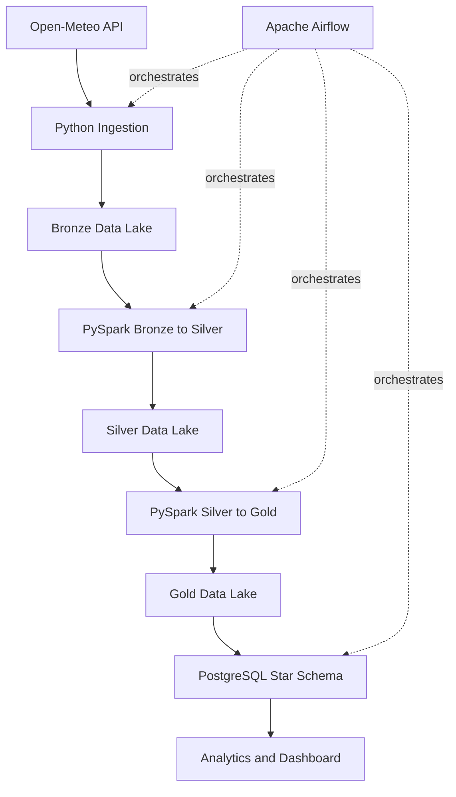

# AgroClimate Data Platform

Plataforma de Engenharia de Dados para coletar, processar, validar e disponibilizar dados meteorologicos aplicados ao agronegocio brasileiro.

## Architecture



## Stack

Python, httpx, PySpark, Parquet, PostgreSQL, Apache Airflow, Docker, pytest, ruff and GitHub Actions.

## Data Lake

The lake follows Bronze, Silver and Gold layers. Bronze stores API-shaped records with ingestion metadata. Silver standardizes types, validates ranges and removes duplicates. Gold aggregates daily metrics and exploratory climate risk indicators.

## Dimensional Model

The warehouse uses `dim_date`, `dim_location`, `dim_source` and `fact_weather_daily`. The fact grain is one row per date, location and source.

## Running Locally

```bash
cp .env.example .env
docker compose up -d
```

Run the ingestion pipeline directly:

```bash
python -m src.pipeline
```

Run tests:

```bash
pytest
```

If Docker or Java is not available on the workstation, the project still supports a local demo path:

```powershell
.\scripts\validate_local.ps1 -SkipDocker
streamlit run dashboard/app.py
```

The dashboard first tries PostgreSQL and falls back to Gold Parquet for local portfolio demos.

## Airflow

Airflow is available at `http://localhost:8080` after Docker Compose starts. The DAG is `agroclimate_pipeline`.

## Data Quality

Rules validate required timestamps and cities, geographic bounds, humidity, precipitation, wind speed and temperature. Invalid records are written to `data/quarantine`.

## Analytics

Sample SQL queries are available in `sql/analytics.sql`, including precipitation by state, monthly temperature, hot city rankings and dry day counts.

## Roadmap

- Add MinIO as an optional S3-compatible lake.
- Add IBGE PAM and CONAB agriculture datasets.
- Add Streamlit dashboard backed by PostgreSQL.
- Expand data quality checks with Great Expectations or Soda.
